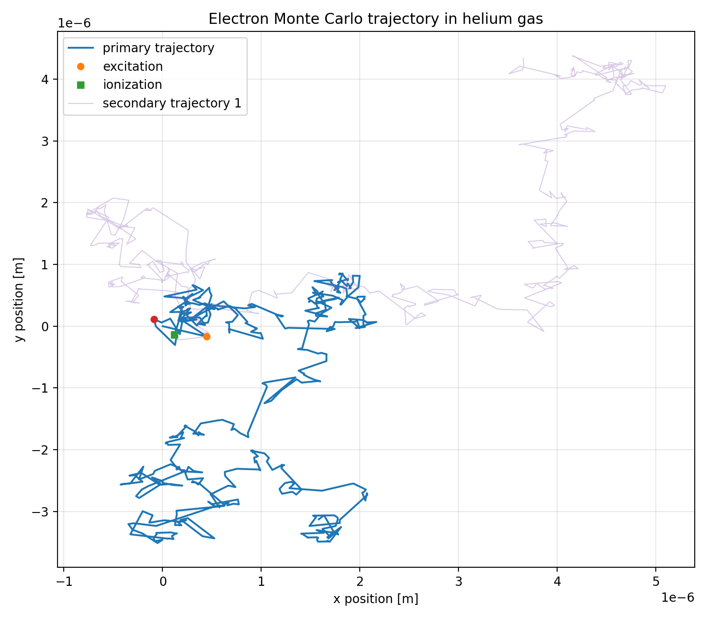

# Electron Gas Monte Carlo

A small, readable **3D null-collision Monte Carlo electron transport code** for gas targets using LXCat-style electron collision cross-section data.

The code follows electron histories through a gas medium, samples candidate collision events, accepts physical collision channels based on tabulated cross sections, and creates secondary electrons during ionization events. It is intended as an educational/research prototype rather than a production electron transport code.



---

## What this code does

This repository models electron motion in gas targets using tabulated electron-collision cross sections. The current example uses helium gas, but the code is written so other gases or gas mixtures can be used if compatible cross-section data are available.

The simulation supports:

- 3D electron motion
- null-collision Monte Carlo sampling
- elastic scattering
- excitation energy loss
- ionization and secondary-electron creation
- attachment, if attachment data are provided
- pure gases and simple gas mixtures
- trajectory histories with time, position, energy, and event type
- 2D trajectory plotting from a Jupyter notebook

The plotted figure is a 2D `x-y` projection of a 3D particle history. The code still stores and updates `x`, `y`, and `z`.

---

## Repository files

```text
electron-gas-monte-carlo/
├── README.md
├── LICENSE
├── requirements.txt
├── electron_mc_transport.py
├── electron_gas_transport.ipynb
└── electron_trajectory.png
```

### Main files

| File | Purpose |
|---|---|
| `electron_mc_transport.py` | Main Monte Carlo transport module |
| `electron_gas_transport.ipynb` | Jupyter notebook for running and plotting simulations |
| `requirements.txt` | Python package requirements |
| `electron_trajectory.png` | Example trajectory plot |
| `LICENSE` | Code license |

---

## Installation

Clone the repository:

```bash
git clone https://github.com/moaks1/electron-gas-monte-carlo.git
cd electron-gas-monte-carlo
```

Create a conda environment:

```bash
conda create -n electron-mc python=3.11
conda activate electron-mc
```

Install the required packages:

```bash
pip install -r requirements.txt
```

Start JupyterLab:

```bash
jupyter lab
```

Then open:

```text
electron_gas_transport.ipynb
```

---

## Cross-section data

This code expects LXCat-style electron collision cross-section files. The notebook currently expects a local file named:

```text
eHexsec.txt
```

The file is intentionally not included in the repository unless redistribution is explicitly allowed by the data source.

A typical LXCat-style file contains blocks such as:

```text
ELASTIC
EXCITATION
IONIZATION
ATTACHMENT
```

with electron energy in eV and microscopic cross section in square meters.

In the notebook, the data file is selected here:

```python
CROSS_SECTION_FILE = "eHexsec.txt"
MATERIAL_NAME = "helium gas"
TARGET_NAME = "He"
NUMBER_DENSITY_M3 = 2.5e26
```

To use another gas, replace the cross-section file and target name.

---

## Basic usage from Python

```python
import numpy as np
import electron_mc_transport as emc

np.random.seed(1)

material = emc.load_lxcat_material(
    "eHexsec.txt",
    material_name="helium gas",
    target_name="He",
    number_density_m3=2.5e26,
)

electron = emc.ElectronParticle(
    energy_eV=100.0,
    material=material,
    idx=0,
)

secondary, event = electron.update(next_idx=1)

print(electron)
print(event)
```

---

## Gas mixture example

The code can model gas mixtures if compatible cross-section data are available for each species.

```python
import electron_mc_transport as emc

n_total = 2.5e26

n2_processes = emc.load_lxcat_table("N2_xsecs.txt", target_name="N2")
o2_processes = emc.load_lxcat_table("O2_xsecs.txt", target_name="O2")
ar_processes = emc.load_lxcat_table("Ar_xsecs.txt", target_name="Ar")

air = emc.make_gas_mixture("air", [
    ["N2", 0.78 * n_total, n2_processes],
    ["O2", 0.21 * n_total, o2_processes],
    ["Ar", 0.01 * n_total, ar_processes],
])

electron = emc.ElectronParticle(
    energy_eV=100.0,
    material=air,
    idx=0,
)
```

For a gas mixture, the total macroscopic cross section is

```text
Sigma_total(E) = sum_i n_i sigma_i(E)
```

where `n_i` is the number density of species `i`, and `sigma_i(E)` is the microscopic cross section for that species.

---

## Monte Carlo method

This code uses a null-collision Monte Carlo method.

At a given electron energy, the real collision frequency is approximately

```text
nu_real(E) = Sigma_total(E) v(E)
```

where `Sigma_total(E)` is the total macroscopic cross section and `v(E)` is the electron speed.

The code samples candidate collision events using a larger trial frequency,

```text
nu_candidate(E) = 2 Sigma_total(E) v(E)
```

so that some sampled events are physical collisions and some are null collisions. With the current factor of 2, about half of the sampled candidate events are null events.

For a physical process `j`, the event probability is proportional to its macroscopic cross section:

```text
P_j(E) = Sigma_j(E) / [2 Sigma_total(E)]
```

The remaining probability is treated as a null event.

---

## Current physics assumptions

The current model assumes:

- nonrelativistic electron speeds
- straight-line motion between candidate collisions
- isotropic scattering after collisions
- tabulated cross sections determine collision probabilities
- excitation removes a fixed threshold energy
- ionization removes the ionization threshold and randomly splits leftover kinetic energy
- no external electric field
- no magnetic field
- no solid-material condensed-history model
- no physical geometry boundary or escape condition

The code is therefore best described as:

> A 3D null-collision Monte Carlo electron transport prototype for gas targets.

It should not be described as a full solid-material electron transport code.

---

## Validation ideas

Suggested validation checks:

1. Plot the loaded cross sections and compare them with the original data table.
2. At fixed electron energy, verify that sampled process frequencies follow the expected cross-section ratios.
3. Check that sampled free paths follow the expected exponential behavior.
4. Verify that excitation subtracts the correct threshold energy.
5. Verify that ionization conserves leftover kinetic energy after subtracting the ionization threshold.
6. Run repeated histories and compare average trends such as energy loss, collision counts, and secondary-electron production.
7. For future electric-field versions, compare swarm quantities such as mean energy or drift velocity against Boltzmann or swarm-code results.

---

## Limitations and future work

Possible future additions:

- external electric-field acceleration
- 3D geometry boundaries and escape conditions
- differential angular scattering
- more physical ionization secondary-energy distributions
- elastic energy loss to the target atom or molecule
- ensemble statistics over many primary electrons
- comparison against Boltzmann or swarm-code benchmarks
- optional 3D trajectory plotting
- cleaner command-line interface

---

## Data citation

If LXCat data are used, cite the database according to the downloaded file's recommended citation format.

For the helium example used during development, the downloaded file identified the source as:

```text
Biagi-v7.1 database, www.lxcat.net, retrieved on May 11, 2026
```

The code license does not automatically apply to downloaded cross-section data. Keep the data source, citation, and redistribution terms separate from the software license.

---

## License

This project is released under the MIT License. See `LICENSE` for details.
